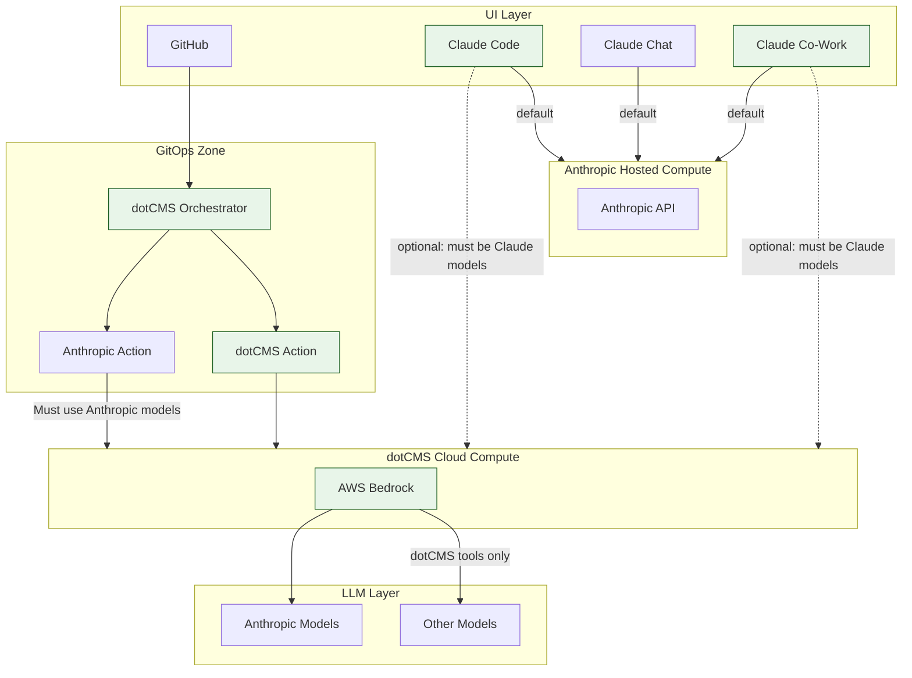

# AI Toolchain Architecture

High-level overview of the dotCMS AI toolchain, illustrating where we have flexibility to avoid vendor lock-in.  Items in Green are flexible for dotCMS to modfy by configuration. 

The **Anthropic Action** (used in GitOps) routes through dotCMS Cloud Compute but is constrained by IAM to Anthropic models only. All dotCMS-owned tools — **dotCMS Github Actions** — route through the same Cloud Compute layer _**AND**_ can reach any model in the LLM layer.

**Claude Code**, **Claude Chat**, and **Claude Co-Work** default to Anthropic Hosted Compute and can optionally route through dotCMS Cloud Compute (AWS Bedrock) instead but must still use the Anthropic Claude models in bedrock.

