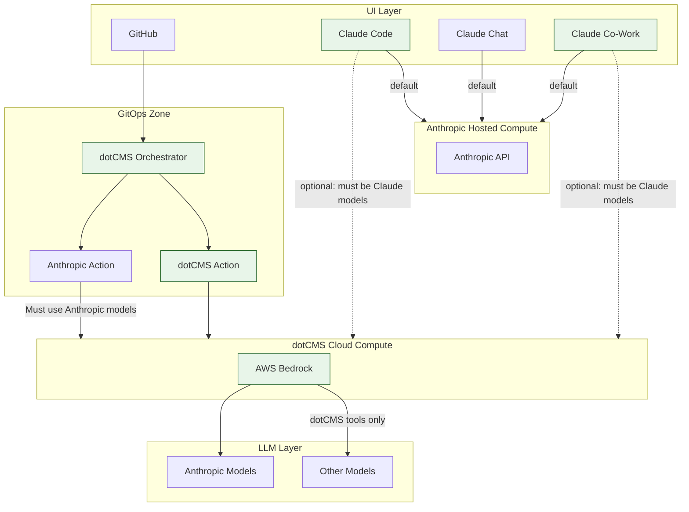
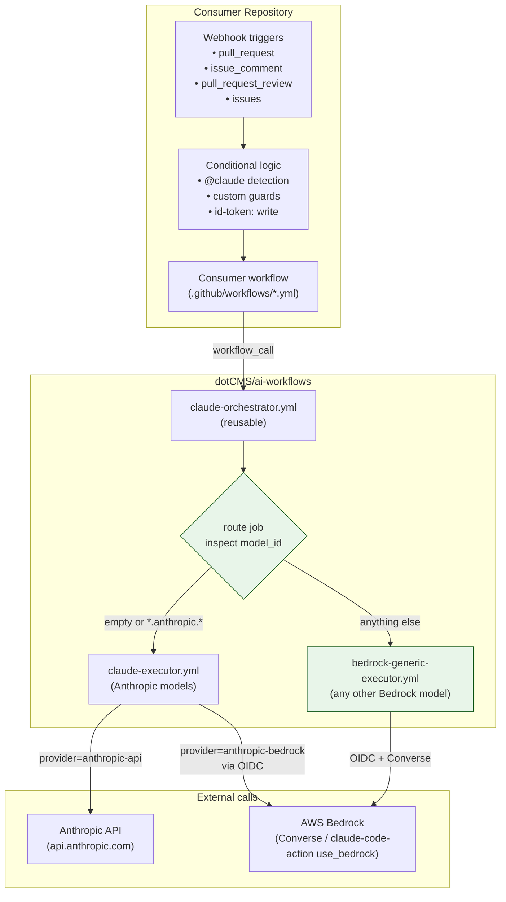

# Architecture

This repository provides centralized, reusable GitHub Actions workflows for AI-assisted code review and automation. As of v3, it supports **any Bedrock model** in addition to the direct Anthropic API path, with routing handled inside the orchestrator so **exactly one executor runs per call**.

Two diagrams below: the first shows where this repository sits in the broader dotCMS AI toolchain; the second is the repo-internal control flow.

---

## Diagram 1 — AI Toolchain (where this repo sits)

High-level overview of the dotCMS AI toolchain, illustrating where we have flexibility to avoid vendor lock-in. Items shaded green are flexible for dotCMS to modify by configuration.

The **Anthropic Action** (used in GitOps) routes through dotCMS Cloud Compute but is constrained by IAM to Anthropic models only. All dotCMS-owned tools — **dotCMS GitHub Actions** — route through the same Cloud Compute layer **AND** can reach any model in the LLM layer.

**Claude Code**, **Claude Chat**, and **Claude Co-Work** default to Anthropic Hosted Compute and can optionally route through dotCMS Cloud Compute (AWS Bedrock) instead, but must still use the Anthropic Claude models in Bedrock.



In this picture, the workflows in this repository implement the **dotCMS Orchestrator** + the two action paths beneath it.

---

## Diagram 2 — Repo-internal control flow (v3)

Consumer repositories handle their own webhook triggers and call this repo's `claude-orchestrator.yml`. The orchestrator inspects `model_id` and fans out to exactly one executor.



Nodes shaded green are new in v3. The `route` job uses an anchored regex (`^([a-z]+\.)?anthropic\.`) so model IDs that merely contain the substring `"anthropic."` (e.g. `us.not-anthropic.foo`) are **not** misrouted.

### Routing table

| `model_id` value                                              | Provider mode       | Executor                          |
| ------------------------------------------------------------- | ------------------- | --------------------------------- |
| _(empty)_                                                     | `anthropic-api`     | `claude-executor.yml`             |
| `anthropic.*` or `<region>.anthropic.*`                       | `anthropic-bedrock` | `claude-executor.yml`             |
| Anything else (`us.amazon.*`, `meta.*`, `mistral.*`, ...)     | n/a                 | `bedrock-generic-executor.yml`    |

The non-matching executor job is **skipped** by job-level `if:` conditional, not "ran and exited" — billable runner time is zero for the skipped path.

---

## Workflow Types

### Consumer workflows

Located in consuming repositories (e.g. `infrastructure-as-code`, `core`):

- Handle webhook events directly (preserves `github.event_name` context, which `workflow_call` would lose)
- Implement trigger conditions and any custom guards (org-membership checks, allowlists, etc.)
- Call centralized workflows with appropriate parameters
- Provide repository-specific configuration (model, prompt, tools, timeouts, IAM role ARN)

### Centralized workflows (this repository)

#### 1. `claude-orchestrator.yml` (entry point)

Lightweight wrapper that handles `@claude` mention detection and routes by `model_id` to the appropriate executor. Consumer repositories almost always call this rather than calling an executor directly.

#### 2. `claude-executor.yml` (Anthropic models)

Runs `anthropics/claude-code-action@v1` with either:
- `provider=anthropic-api` — direct Anthropic API (requires `ANTHROPIC_API_KEY` secret)
- `provider=anthropic-bedrock` — `use_bedrock: true` over AWS Bedrock (requires `bedrock_role_arn` input + OIDC)

Includes a pre-flight API health check on the `anthropic-api` path that skips gracefully on Anthropic 5xx.

#### 3. `bedrock-generic-executor.yml` (any non-Anthropic Bedrock model) — **new in v3**

Uses the Bedrock Converse API, which is model-family-agnostic. Maintains its own sticky comment via an inline helper (a setup step writes a bash find-or-update helper to `/tmp` so the logic isn't dependent on the consumer's checkout), replicating the auto-update behavior `claude-code-action` provides for free on the Anthropic path. Accepts a `sticky_namespace` input so multiple review jobs on the same PR don't clobber each other.

---

## Key benefits

### Reliable event handling
Consumer repositories maintain full control over webhook events — no loss of event context, no double triggering.

### DRY
Centralized execution logic. One place to update Claude Code action versions, IAM patterns, sticky-comment behavior.

### Cost discipline
Exactly one executor runs per orchestrator call. Selecting a Claude model never invokes the generic Bedrock path in parallel.

### Security isolation
- Anthropic API path requires per-consumer `ANTHROPIC_API_KEY` (cost tracked per repo, no shared credentials)
- Bedrock paths use short-lived OIDC-issued STS credentials — no long-lived AWS secrets in GitHub Actions secrets
- `ANTHROPIC_API_KEY` is `required: false` on the orchestrator schema since v3 — consumers that only use Bedrock paths don't need it

### Flexibility
- Any model AWS Bedrock offers, swappable via the `model_id` input
- Per-repo prompts, tool configurations, timeouts
- Per-job `sticky_namespace` to prevent comment collisions

---

## Migration path

### v2 consumer (Anthropic API only)

```yaml
jobs:
  claude-automatic:
    if: github.event_name == 'pull_request'
    uses: dotCMS/ai-workflows/.github/workflows/claude-orchestrator.yml@v2.1.0
    with:
      trigger_mode: automatic
      prompt: Review this PR for code quality and security.
    secrets:
      ANTHROPIC_API_KEY: ${{ secrets.ANTHROPIC_API_KEY }}
```

### v3 consumer — backward compatible (no changes needed)

The v2 invocation above continues to work unchanged. `model_id` defaults to empty → `anthropic-api` path.

### v3 consumer — Anthropic via Bedrock (no API key needed)

```yaml
jobs:
  claude-bedrock:
    permissions:
      id-token: write
      contents: write
      pull-requests: write
      issues: write
    uses: dotCMS/ai-workflows/.github/workflows/claude-orchestrator.yml@v3.0.0
    with:
      trigger_mode: automatic
      enable_mention_detection: false
      prompt: Review this PR for correctness, security, and design issues.
      model_id: global.anthropic.claude-sonnet-4-6
      bedrock_role_arn: arn:aws:iam::123456789012:role/GitHubActions-BedrockReview
```

### v3 consumer — any non-Anthropic Bedrock model

```yaml
jobs:
  nova-review:
    permissions:
      id-token: write
      contents: read
      pull-requests: write
    uses: dotCMS/ai-workflows/.github/workflows/claude-orchestrator.yml@v3.0.0
    with:
      trigger_mode: automatic
      enable_mention_detection: false
      prompt: Review this PR for backend Java/Spring issues.
      model_id: us.amazon.nova-pro-v1:0
      bedrock_role_arn: arn:aws:iam::123456789012:role/GitHubActions-BedrockReview
      sticky_namespace: backend-reviewer
```

> **Note on permissions**: when invoking the orchestrator, the caller's `permissions:` block must be at least as broad as the strictest executor it could route to. `claude-executor.yml` requires `contents: write` + `issues: write` (legacy of the v2 interactive flow). `bedrock-generic-executor.yml` only needs `contents: read` + `pull-requests: write` + `id-token: write`. If your consumer is wired to use both paths (or might in the future), grant the union.

---

## Why this architecture?

The original orchestrator design attempted to centralize trigger logic, but GitHub Actions `workflow_call` loses the original webhook event context. When a consumer workflow calls a reusable workflow:

1. Consumer receives `issue_comment` event
2. Consumer calls orchestrator via `workflow_call`
3. Orchestrator sees `github.event_name` as `"workflow_call"`, not `"issue_comment"`
4. All conditional logic fails
5. Multiple jobs may trigger unexpectedly

The current architecture solves this by keeping trigger logic where the event context is available (in the consumer workflow) and using centralized workflows only for execution and model routing.

For the cost-doubling concern that motivated v3's routing job: see the `route` job in `claude-orchestrator.yml` and the mutually-exclusive `if:` conditions on the two `Run Claude Code` steps inside `claude-executor.yml`. The non-matching executor is skipped at the job level, before any runner is allocated.
