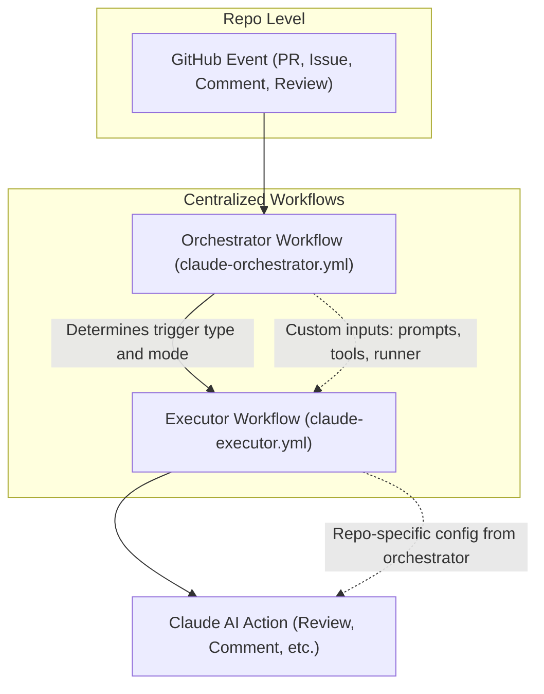

# ai-workflows
Centralized Claude AI tooling, workflows, configurations, and supposedly best practices for dotCMS and related projects

## 🎯 Repository Purpose

This repository serves as the **central hub for all Claude AI tooling and integrations** across dotCMS projects. It provides:

- **🔄 Reusable GitHub Actions workflows** - Claude orchestrator, executor, and deployment guard workflows
- **⚙️ Shared configurations** - Claude settings, development patterns, and cursor rules
- **🛠️ Custom tools & commands** - Slash commands like `/weekly-work` for team productivity
- **📚 Best practices & examples** - Proven patterns for Claude integration across repositories
- **🔒 Security tooling** - Deployment validation with organization-based trust and configurable rules

**Share internally and externally**: Everything here is designed to be reusable across dotCMS repositories and shareable with the broader community.  It is a pubic repo after all 😄 

---

## 🚀 What's Inside

### GitHub Actions Workflows

**Centralized, DRY, and maintainable workflows** for Claude AI integration:

- **Claude Orchestrator** (`claude-orchestrator.yml`) - Routes triggers with @claude mention detection
- **Claude Executor** (`claude-executor.yml`) - Executes Claude actions with configurable tools
- **Deployment Guard** (`deployment-guard.yml`) - Validates deployment changes with org-based bypass

**Migration**: Replaces the pilot workflow previously used in `dotcms/infrastructure-as-code`. See [CLAUDE_WORKFLOW_MIGRATION.md](./CLAUDE_WORKFLOW_MIGRATION.md) for details.

### Claude Commands & Tools

Custom slash commands for enhanced productivity:

- **`/weekly-work`** - Generate team work summaries from merged PRs within date ranges
- Located in `.claude/commands/` for easy sharing across repositories

### Development Guidelines

Comprehensive best practices and patterns:

- **`.cursor/rules/`** - Modular development rules (terminal commands, git workflow, release process, error prevention)
- **`CLAUDE.md`** - Repository-specific guidance for Claude Code
- **`ARCHITECTURE.md`** - Deep dive into workflow architecture and design decisions

### Examples & Templates

Working examples for quick adoption:

- **`examples/consumer-repo-workflow.yml`** - Basic @claude mention integration
- **`examples/infrastructure-consumer-workflow.yml`** - Infrastructure-specific tooling
- **`examples/advanced-custom-triggers.yml`** - Custom trigger patterns

---

## Migration Guide: From Pilot to Centralized Workflows

If you previously used the pilot Claude workflow in `dotcms/infrastructure-as-code`, follow these steps:

### 📋 Migration Checklist

1. **Remove references to the old pilot workflow** in your repository's workflow files.
2. **Update your workflow to use the new orchestrator with version tags:**

   ```yaml
   jobs:
     claude:
       uses: dotCMS/ai-workflows/.github/workflows/claude-orchestrator.yml@v1.0.0
       with:
         trigger_mode: automatic  # or 'interactive' for @claude mentions
         # Customize as needed for your repo
         allowed_tools: |
           Bash(terraform plan)
           Bash(git status)
         direct_prompt: |
           Please review this pull request for code quality, security, and best practices.
         enable_mention_detection: true  # Enable @claude mention detection
       secrets:
         ANTHROPIC_API_KEY: ${{ secrets.ANTHROPIC_API_KEY }}
   ```

   ⚠️ **Important**: Always use version tags (e.g., `@v1.0.0`) instead of `@main` for production stability. Using `@main` can cause unexpected behavior when the main branch is updated.

3. **Configure your `ANTHROPIC_API_KEY` secret** as described below.
4. **(Optional) Customize prompts, allowed tools, and runner as needed.**
5. **Test your migration** with a sample PR or @claude mention.

---

## 📚 Migration Details

For a comprehensive migration guide—including step-by-step instructions, validation tips, and infrastructure-specific configuration examples—see [CLAUDE_WORKFLOW_MIGRATION.md](./CLAUDE_WORKFLOW_MIGRATION.md).

---

## Top-Level Points

- **Centralized, DRY, and maintainable:** All Claude logic is now in one place, making updates and improvements easy.
- **Repo-level flexibility:** Each repository can override prompts, tools, and other settings via workflow inputs.
- **Security & cost management:** Each repo must provide its own Anthropic API key for isolation and accountability.
- **No more standalone code review workflow:** All code review and other Claude actions are routed through the orchestrator/executor pattern.

---

## 🗺️ Workflow Visualization



---

## Important: Security and Cost Management

**⚠️ API Key Requirement**: All workflows in this repository require each consuming repository to provide its own Anthropic API key. This is a mandatory security and cost management requirement.

**Why we require per-repository API keys:**

1. **Cost Tracking & Accountability**: Each repository's Claude AI usage is tracked separately in the Anthropic console, allowing for detailed cost attribution and budget management per project.
2. **Security Isolation**: If a repository experiences unauthorized or excessive usage, it only affects that repository's API key and budget, not a shared organizational key.
3. **Usage Control**: Individual repositories can set their own API limits and monitoring, preventing runaway costs from affecting other projects.
4. **Compliance**: Many organizations require API key isolation for audit trails and security compliance.

**What this means for you:**
- You **must** configure an `ANTHROPIC_API_KEY` secret in your repository
- You **must** pass this secret to the reusable workflow in the `secrets:` section
- The workflow will **fail** if the API key is not provided
- Each repository is responsible for its own API costs and usage

---

## Available Workflows

### Claude Orchestrator (`claude-orchestrator.yml`)
Routes all Claude triggers (PRs, issues, comments, reviews) to the correct execution mode. Features built-in @claude mention detection and support for custom trigger conditions.

### Claude Executor (`claude-executor.yml`)
Handles the actual execution of Claude actions, with configurable parameters (prompts, allowed tools, runner, etc.).

### Deployment Guard (`deployment-guard.yml`)
Validates deployment changes with sophisticated rules:
- Organization-based bypass for trusted public members
- File allowlist validation (glob patterns)
- Image-only change detection
- Image validation (format, repository, version, registry existence, anti-downgrade)
- Testing mode for validation logic verification

---

## Using Custom Commands

### Installing Slash Commands

Copy commands from `.claude/commands/` to your repository's `.claude/commands/` directory to make them available in Claude Code.

**Example: Weekly Work Summary**

1. Copy `.claude/commands/weekly-work.md` to your repo
2. Use in Claude Code: `/weekly-work falcon 2025-01-20 2025-01-26`
3. Get a consolidated summary of merged PRs grouped by feature/topic

### Sharing Cursor Rules

The `.cursor/rules/` directory contains modular development guidelines:

- **terminal-commands.md** - ZSH escaping, safe command patterns
- **git-workflow.md** - Git and GitHub CLI best practices
- **release-process.md** - Release automation and semantic versioning
- **error-prevention.md** - Common issues and recovery procedures
- **development-patterns.md** - Code quality and testing standards
- **thoughtful-execution.md** - Planning and collaboration principles

Copy these to your repository's `.cursor/rules/` directory to share best practices with your team.

---

## Quick Start

### 1. Using GitHub Actions Workflows

**Repository Secret Configuration**

Each consuming repository must configure its own Anthropic API key:

1. Go to your repository's Settings → Secrets and variables → Actions
2. Create a new repository secret named `ANTHROPIC_API_KEY`
3. Set the value to your Anthropic API key

**Create a Workflow File**

Create a workflow file in your repository at `.github/workflows/claude-review.yml` (or similar):

```yaml
name: Claude AI Integration

on:
  issue_comment:
    types: [created]
  pull_request_review_comment:
    types: [created]  
  issues:
    types: [opened, assigned]
  pull_request_review:
    types: [submitted]
  pull_request:
    types: [opened, synchronize]

jobs:
  # Interactive Claude mentions using built-in detection
  claude-interactive:
    uses: dotCMS/ai-workflows/.github/workflows/claude-orchestrator.yml@v1.0.0
    with:
      trigger_mode: interactive
      allowed_tools: |
        Bash(git status)
        Bash(git diff)
      enable_mention_detection: true  # Uses built-in @claude detection
    secrets:
      ANTHROPIC_API_KEY: ${{ secrets.ANTHROPIC_API_KEY }}

  # Automatic PR reviews (no @claude mention required)
  claude-automatic:
    if: github.event_name == 'pull_request'
    uses: dotCMS/ai-workflows/.github/workflows/claude-orchestrator.yml@v1.0.0
    with:
      trigger_mode: automatic
      direct_prompt: |
        Please review this pull request for code quality, security, and best practices.
      allowed_tools: |
        Bash(git status)
        Bash(git diff)
      enable_mention_detection: false  # No mention detection for automatic reviews
    secrets:
      ANTHROPIC_API_KEY: ${{ secrets.ANTHROPIC_API_KEY }}
```

### 3. Workflow Inputs

| Input | Description | Required | Default |
|-------|-------------|----------|---------|
| `trigger_mode` | Mode: `interactive` or `automatic` | **Yes** | - |
| `direct_prompt` | Custom prompt for automatic mode | No | - |
| `allowed_tools` | Custom allowed tools configuration | No | `Bash(git status)`<br>`Bash(git diff)` |
| `timeout_minutes` | Timeout for Claude execution | No | 15 |
| `runner` | GitHub runner to use | No | ubuntu-latest |
| `enable_mention_detection` | Enable built-in @claude mention detection | No | true |
| `custom_trigger_condition` | Custom condition to override default detection | No | - |

### 4. Advanced: Custom Trigger Conditions

For advanced use cases beyond @claude mentions, use `custom_trigger_condition`:

```yaml
jobs:
  claude-security-review:
    uses: dotCMS/ai-workflows/.github/workflows/claude-orchestrator.yml@v1.0.0
    with:
      trigger_mode: automatic
      custom_trigger_condition: |
        github.event_name == 'pull_request' && (
          contains(github.event.pull_request.title, 'security') ||
          contains(github.event.pull_request.body, 'vulnerability')
        )
      direct_prompt: |
        This appears to be a security-related change. Please review for security implications.
      enable_mention_detection: false  # Disable default detection when using custom condition
    secrets:
      ANTHROPIC_API_KEY: ${{ secrets.ANTHROPIC_API_KEY }}
```

**Note**: When using `custom_trigger_condition`, set `enable_mention_detection: false` to avoid conflicts.

---

## Examples

See the `examples/` directory for complete workflow examples:

- **`consumer-repo-workflow.yml`** - Basic usage with @claude mentions
- **`infrastructure-consumer-workflow.yml`** - Infrastructure-specific tooling  
- **`advanced-custom-triggers.yml`** - Advanced examples using `custom_trigger_condition` for specialized triggers (urgent issues, security reviews, config changes, etc.)

### Quick Examples

**Basic @claude mention detection:**
```yaml
uses: dotCMS/ai-workflows/.github/workflows/claude-orchestrator.yml@v1.0.0
with:
  trigger_mode: interactive
  enable_mention_detection: true
```

**Automatic PR reviews:**
```yaml
uses: dotCMS/ai-workflows/.github/workflows/claude-orchestrator.yml@v1.0.0
with:
  trigger_mode: automatic
  direct_prompt: "Review this PR for quality and security."
  enable_mention_detection: false
```

**Custom triggers for urgent issues:**
```yaml
uses: dotCMS/ai-workflows/.github/workflows/claude-orchestrator.yml@v1.0.0
with:
  trigger_mode: interactive
  custom_trigger_condition: |
    github.event_name == 'issues' &&
    contains(github.event.issue.labels.*.name, 'urgent')
  enable_mention_detection: false
```

---

## Repository Structure

```
ai-workflows/
├── .github/workflows/          # Reusable GitHub Actions workflows
│   ├── claude-orchestrator.yml # Claude workflow router
│   ├── claude-executor.yml     # Claude execution engine
│   ├── deployment-guard.yml    # Deployment validation
│   └── tests.yml               # Automated workflow testing
├── .claude/
│   ├── commands/               # Custom slash commands
│   │   └── weekly-work.md      # Team work summary generator
│   └── settings.local.json     # Claude Code settings
├── .cursor/rules/              # Development best practices
│   ├── terminal-commands.md    # Safe command patterns
│   ├── git-workflow.md         # Git & GitHub CLI patterns
│   ├── release-process.md      # Release automation
│   ├── error-prevention.md     # Troubleshooting guide
│   ├── development-patterns.md # Code quality standards
│   └── thoughtful-execution.md # Collaboration principles
├── examples/                   # Working examples
│   ├── consumer-repo-workflow.yml
│   ├── infrastructure-consumer-workflow.yml
│   └── advanced-custom-triggers.yml
├── ARCHITECTURE.md             # Workflow architecture deep dive
├── CLAUDE.md                   # Claude Code guidance
├── CLAUDE_WORKFLOW_MIGRATION.md # Migration guide
└── README.md                   # This file
```

---

## Adopting This Repository's Tooling

### For Your Repository

**Pick what you need:**

1. **GitHub Actions only**: Use the workflows via `uses:` statements (see Quick Start)
2. **Commands**: Copy `.claude/commands/` files to your repo
3. **Development rules**: Copy `.cursor/rules/` files to your repo
4. **Full adoption**: Use workflows + copy commands + copy rules for comprehensive Claude integration

### For Internal Teams

This repository is designed for both internal dotCMS use and external sharing:

- **Internal**: All dotCMS repositories can adopt these workflows and tools
- **External**: Community members can use these patterns in their own projects
- **Contributions welcome**: Improvements and new tools benefit everyone

### Version Tags

**Always use version tags** (`@v1.0.0`) instead of `@main` for production stability:

```yaml
# ✅ Production-safe
uses: dotCMS/ai-workflows/.github/workflows/claude-orchestrator.yml@v1.0.0

# ❌ Unstable - avoid for production
uses: dotCMS/ai-workflows/.github/workflows/claude-orchestrator.yml@main
```

---

## Learn More

- **[ARCHITECTURE.md](./ARCHITECTURE.md)** - Understand why consumer-handled triggers are necessary
- **[CLAUDE.md](./CLAUDE.md)** - Repository-specific guidance for Claude Code
- **[CLAUDE_WORKFLOW_MIGRATION.md](./CLAUDE_WORKFLOW_MIGRATION.md)** - Migrate from pilot workflows
- **[examples/](./examples/)** - Working examples for different use cases
- **[.cursor/rules/](./.cursor/rules/)** - Comprehensive development best practices

---

## Contributing

Improvements to workflows, commands, and best practices benefit the entire dotCMS ecosystem and community. When contributing:

1. Test changes thoroughly (workflows have automated tests in `.github/workflows/tests.yml`)
2. Update documentation (CLAUDE.md, ARCHITECTURE.md, README.md)
3. Follow semantic versioning for releases
4. Add examples for new features

See `.cursor/rules/` for development patterns and best practices.
